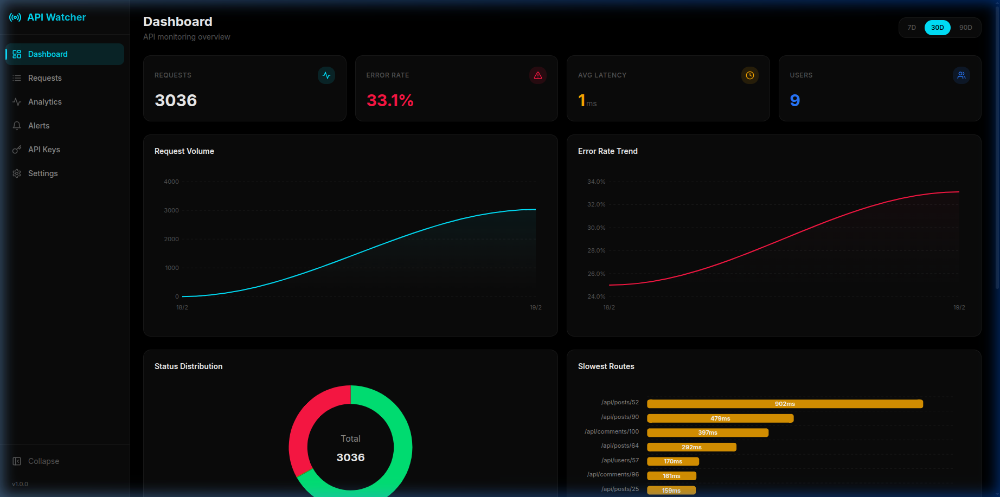
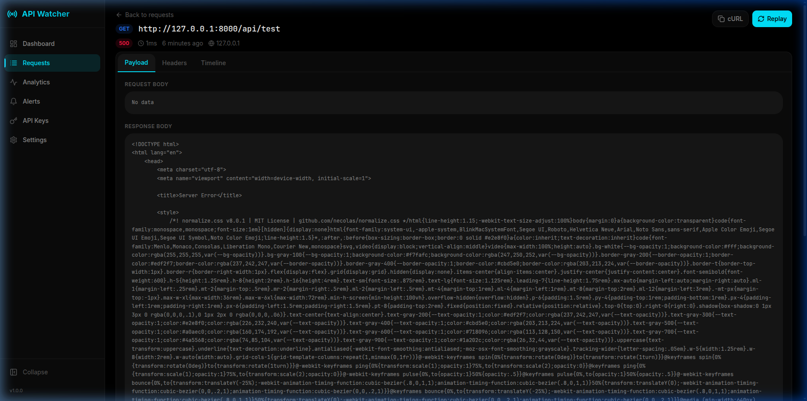
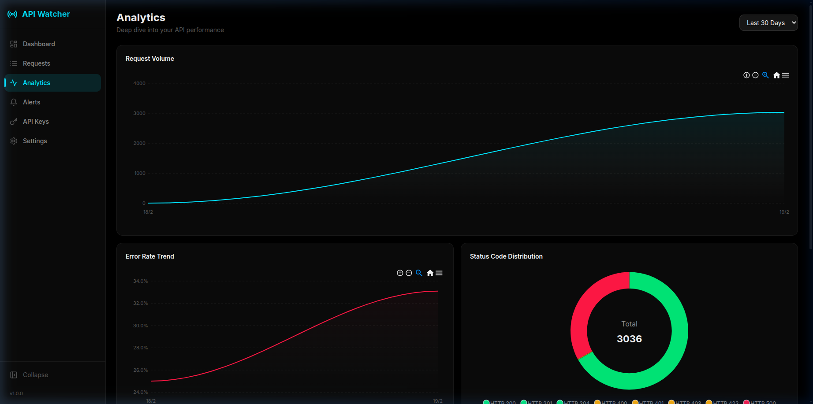
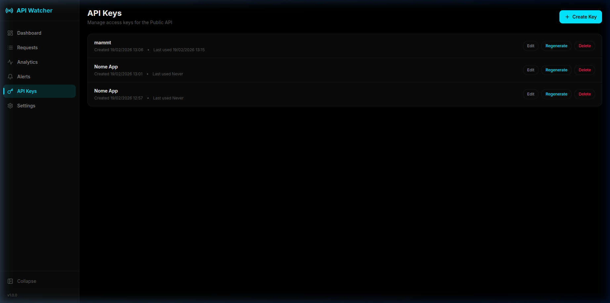

# Laravel API Watcher 🦅

[](https://packagist.org/packages/taoshan98/laravel-api-watcher)
[](https://packagist.org/packages/taoshan98/laravel-api-watcher)
[](https://packagist.org/packages/taoshan98/laravel-api-watcher)

**Laravel API Watcher** is a powerful, zero-latency monitoring and debugging tool for your API. It provides a beautiful dashboard to inspect requests, analyze performance trends, and receive proactive health alerts.



## ✨ Features

-   **🔍 Request Inspector**: View detailed logs of every API request (Headers, Body, Response, Queries, Timeline).
-   **🚀 Zero Latency**: Uses `dispatch()->afterResponse()` to ensure monitoring never slows down your API.
-   **📊 Analytics Dashboard**: Visualize request volume, error rates, and latency trends.
-   **🛡️ Sensitive Data Redaction**: Automatically masks passwords, tokens, and credit cards.
-   **🔌 Public API**: Secure, authenticated API to retrieve logs programmatically (supports **Database-backed API Keys**).
-   **🔐 Security & Privacy**:
    -   **Encryption at Rest**: Optional AES-256 encryption for request bodies.
    -   **Hashed API Keys**: Keys are stored securely using SHA-256 hashing.
    -   **Authorization**: Dashboard access restricted by Gate.
-   **🚨 Proactive Alerting**: Receive notifications via **Mail** or any **Custom Channel** when error rates or latency spike.
-   **🛠️ Maintenance Tools**: Prune old logs, export data (JSON/CSV), and clear history directly from the UI.
-   **🌑 Dark Mode**: Fully supported dark mode for late-night debugging.

## 📸 Screenshots

### Dashboard
Overview of your API health with real-time stats and performance charts.


### Request Inspector
Deep dive into request details with payload formatting, headers, and timeline execution.


### Analytics
Analyze traffic trends, status code distribution, and slowest endpoints.


### API Management
Manage secure access keys for the Public API.


---

## 🚀 Installation

1.  **Require the package via Composer**:

    ```bash
    composer require taoshan98/laravel-api-watcher
    ```

2.  **Publish the configuration and assets**:

    ```bash
    php artisan vendor:publish --tag=api-watcher-config
    php artisan vendor:publish --tag=api-watcher-assets
    ```

3.  **Run Migrations**:

    ```bash
    php artisan migrate
    ```

    ```bash
    php artisan api-watcher:clear
    ```

    #### Manage API Keys
    - **List Keys**: `php artisan api-watcher:list-keys`
    - **Create Key**: `php artisan api-watcher:create-key "My App"`
    - **Rename Key**: `php artisan api-watcher:rename-key {id} "New Name"`
    - **Regenerate Key**: `php artisan api-watcher:regenerate-key {id}`
    - **Delete Key**: `php artisan api-watcher:delete-key {id}`

4.  **Add the Middleware**:
    Add `CaptureApiRequest` to your `api` middleware group in `bootstrap/app.php` (Laravel 11) or `app/Http/Kernel.php` (Laravel 10).

    ```php
    // bootstrap/app.php
    ->withMiddleware(function (Middleware $middleware) {
        $middleware->api(prepend: [
            \Taoshan98\LaravelApiWatcher\Middleware\CaptureApiRequest::class,
        ]);
    })
    ```

5.  **Schedule the Monitor** (Optional, for Alerts):
    In `routes/console.php`:
    ```php
    Schedule::command('api-watcher:monitor')->everyFiveMinutes();
    ```

### 🔄 Keeping Assets Updated

When you update the package, the compiled dashboard assets in your `public` folder need to be synchronized. To automate this, add the following to your `composer.json` file:

```json
"scripts": {
    "post-update-cmd": [
        "@php artisan vendor:publish --tag=api-watcher-assets --force --quiet"
    ]
}
```

---

## ⚙️ Configuration

The configuration file is located at `config/api-watcher.php`.

### Basic Settings
```env
# Enable/Disable Recording
API_WATCHER_ENABLED=true

# Dashboard Path (Default: /api-watcher)
API_WATCHER_PATH=api-watcher
```

### 🔒 Security

#### Dashboard Access
By default, the dashboard is only accessible in `local` environment. To allow access in production, define the `viewApiWatcher` gate in your `AppServiceProvider`:

```php
use Illuminate\Support\Facades\Gate;

public function boot()
{
    Gate::define('viewApiWatcher', function ($user) {
        return in_array($user->email, ['admin@yourcompany.com']);
    });
}
```

#### Data Encryption
To encrypt request headers and bodies in the database:
```env
API_WATCHER_ENCRYPT_BODY=true
```

---

## 🔌 Public API

You can programmatically retrieve logs and statistics via the secure Public API. The API is authenticated mechanism using database-backed keys.

### 1. Enable
In `.env`:
```env
API_WATCHER_API_ENABLED=true
```

### 2. Manage Keys
You can generate API Tokens via the **Dashboard** > **API Keys** or via Artisan:

```bash
php artisan api-watcher:create-key "My App"
```
Or via the UI: Go to `/api-watcher/keys`.
*Note*: Keys are hashed. You can only see the token once upon creation.

### 3. Endpoints
Pass the key in the header: `X-API-WATCHER-KEY: <your-token>`.

- `GET /api-watcher/api/v1/stats`: Returns total requests, error rate, and trends.
- `GET /api-watcher/api/v1/requests`: List requests with filters (`status_code`, `method`, `date_from`, etc.).
- `GET /api-watcher/api/v1/requests/{id}`: Get full details of a request.

---

## 🚨 Alerts & Monitoring

API Watcher checks your API health every 5 minutes (via the scheduled command).

### Configuration
In `config/api-watcher.php`:
```php
'alerts' => [
    'enabled' => true,
    'channels' => ['mail'], // Supports 'slack', 'discord', or custom classes
    'thresholds' => [
        'error_rate' => 5, // Alert if > 5% requests are errors
        'high_latency_ms' => 1000, // Alert if avg latency > 1000ms
    ],
    'check_interval_minutes' => 5,
],
```

---

## 🧼 GDPR & Pruning

To keep your database clean, the `prune` command automatically deletes logs older than the configured retention period (default: 30 days).

```bash
# Run manually
php artisan api-watcher:prune

# Schedule in routes/console.php
Schedule::command('api-watcher:prune')->daily();
```

---

## 🤝 Contributing

Please see [CONTRIBUTING](CONTRIBUTING.md) for details.

## 📄 License

The MIT License (MIT). Please see [License File](LICENSE) for more information.
