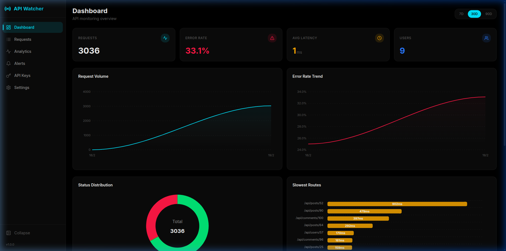
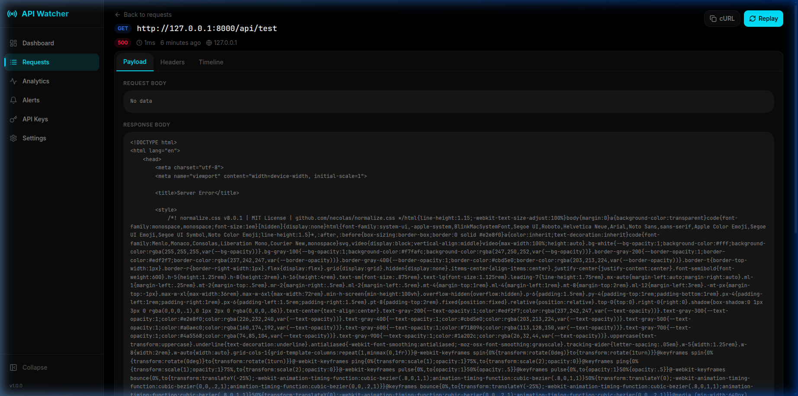
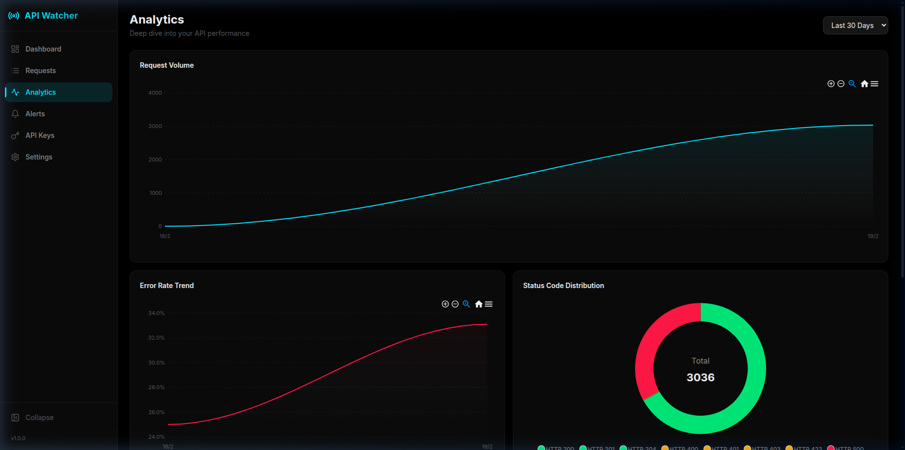

# Laravel API Watcher 🦅 (V2.0.0 - Full Observability Suite)

[](https://packagist.org/packages/taoshan98/laravel-api-watcher)
[](https://packagist.org/packages/taoshan98/laravel-api-watcher)
[](https://packagist.org/packages/taoshan98/laravel-api-watcher)
[](https://phpstan.org/)

**Laravel API Watcher** is a zero-latency, production-ready **360° API Observability Suite** for Laravel applications. It monitors both **Ingress** (incoming API requests from users/clients) and **Egress** (outgoing HTTP requests to third-party services like Stripe, OpenAI, or Twilio) without impacting application response times.



---

## 🔬 System Architecture & Technical Features

### 1. ⚡ Zero-Latency Ingress Logging
* **Lifecycle Hook**: Capture logic executes strictly after HTTP responses are dispatched to clients via Laravel's `terminating` middleware callback (`dispatch()->afterResponse()`). The client never waits for DB logging operations.
* **Fail-Safe Mechanism**: All capture routines operate inside isolated `try-catch` blocks. Logging or database failures are swallowed silently, ensuring 100% uptime for core application routes.

### 2. 🌐 Egress Observability (Outgoing HTTP Interception)
* **Automatic Event Interception**: Listens natively to `Illuminate\Http\Client\Events\ResponseReceived` and `Illuminate\Http\Client\Events\ConnectionFailed`.
* **Parent-Child Request Correlation**: Automatically attaches a unique UUID (`api_watcher_request_id`) to the incoming request context, linking all outgoing HTTP calls triggered during that request execution.
* **Dedicated Egress Dashboard**: View latencies, status codes, payload samples, and error rates per third-party domain (e.g. `api.stripe.com`, `api.openai.com`).

### 3. 🎯 Intelligent Sampling Engine
To optimize storage in high-volume production environments, the sampling algorithm evaluates every request against configured rules:
```php
public function shouldSample(int $statusCode, float $durationMs): bool
{
    // Always sample 4xx/5xx errors
    if ($this->alwaysSampleErrors && $statusCode >= 400) {
        return true;
    }
    // Always sample slow requests exceeding configured threshold
    if ($this->alwaysSampleSlow && $durationMs >= $this->slowThresholdMs) {
        return true;
    }
    // Apply probabilistic sampling for 2xx OK requests
    return (mt_rand(1, 100) / 100.0) <= $this->samplingRate;
}
```

### 4. 🚀 High-Throughput Redis List Buffering
For high-traffic APIs (thousands of req/sec), bypass direct SQL writes during request handling:
```
Incoming Request -> Redis List Buffer (rpush) -> Background Worker (api-watcher:flush) -> Database Batch Insert
```
* **Memory Efficient**: Buffers raw payload data into Redis lists using `rpush`.
* **Artisan Worker**: `php artisan api-watcher:flush` pops buffered items via `lpop` and executes `DatabaseDriver::storeBatch()` using bulk `insert()`.

### 5. 🛡️ Multilevel Data Redaction & Privacy (GDPR / PCI-DSS)
* **Recursive Array & String Sanitization**: `SensitiveDataRedactor` recursively inspects arrays, JSON strings, and `application/x-www-form-urlencoded` query strings.
* **Custom Callbacks**: Developers can register custom closures to redact application-specific sensitive fields:
```php
'redaction' => [
    'fields' => ['password', 'secret', 'credit_card', 'authorization', 'token'],
    'replacement' => '[REDACTED]',
    'callback' => function (array $data) {
        unset($data['ssn']);
        return $data;
    },
]
```

### 6. 🧠 Diagnostic & Analytics Algorithmic Engine
* **Visual Waterfall Execution Timeline**: Correlates DB query execution time (`DB::listen`) with outgoing HTTP calls.
* **Side-by-Side Request Diffing**: `RequestDiff::compare($req1, $req2)` computes structural JSON deltas, duration deltas, and header variations between any two requests.
* **Schema Drift Detector**: `SchemaDriftDetector` computes a structural type-mapping hash (`describeArraySchema`) for JSON responses across time to notify developers of breaking payload changes.
* **Predictive Latency Trend Analyzer**: `TrendAnalyzer` compares the 24-hour moving average against a 7-day baseline:
  $$\Delta\% = \frac{\bar{T}_{24h} - \bar{T}_{baseline}}{\bar{T}_{baseline}} \times 100$$
  Triggers a degradation warning when latency increases by $\ge 25\%$.
* **Bot & Abuse Detector**: `AbuseDetector` analyzes IP address distributions over a 60-minute window, flagging IPs with high request volumes or error rates ($\ge 30\%$ 401/429/403 errors).

### 7. 📦 Memory-Efficient Streaming Exporters
* **Chunked Exporters**: Exporting logs via `php artisan api-watcher:export --format=json` uses `cursor()` / `chunk(500)` with direct file stream pointers (`fwrite`), maintaining flat RAM usage even on multi-million row tables.
* **Postman Collection v2.1 Exporter**: `php artisan api-watcher:export-postman` builds a ready-to-import Postman Collection v2.1 JSON file.
* **SLA & Uptime Report Generator**: `php artisan api-watcher:report` compiles SLA Uptime percentages, P95/P99 latency calculations, and status code distributions into a structured report.

### 8. 🚨 Multichannel Proactive Alerting
Alerts trigger when error rates or average latencies breach configured thresholds. Supports:
* **Mail Notifications** (Laravel Mail)
* **Slack Webhooks**
* **Generic HTTP Webhooks** (Teams, Discord, Custom Endpoints)

---

## 📸 Dashboard Preview

### Request Inspector
Deep dive into request details with payload formatting, headers, DB queries, and timeline execution.


### Egress & Outgoing Requests
Monitor third-party API call latencies, status codes, and error distributions.


---

## 🚀 Installation & Setup

### 1. Require Package
```bash
composer require taoshan98/laravel-api-watcher
```

### 2. Publish Assets & Configuration
```bash
php artisan vendor:publish --tag=api-watcher-config
php artisan vendor:publish --tag=api-watcher-assets
```

### 3. Run Migrations
```bash
php artisan migrate
```

### 4. Register Middleware
In Laravel 11 (`bootstrap/app.php`):
```php
->withMiddleware(function (Middleware $middleware) {
    $middleware->api(prepend: [
        \Taoshan98\LaravelApiWatcher\Http\Middleware\CaptureApiRequest::class,
    ]);
})
```

In Laravel 10 (`app/Http/Kernel.php`):
```php
protected $middlewareGroups = [
    'api' => [
        \Taoshan98\LaravelApiWatcher\Http\Middleware\CaptureApiRequest::class,
        // ...
    ],
];
```

### 5. Schedule Automated Maintenance & Monitoring
In `routes/console.php`:
```php
use Illuminate\Support\Facades\Schedule;

// Monitor API health every 5 minutes
Schedule::command('api-watcher:monitor')->everyFiveMinutes();

// Flush Redis buffer every minute (if using Redis driver)
Schedule::command('api-watcher:flush')->everyMinute();

// Prune old logs daily
Schedule::command('api-watcher:prune --days=30')->daily();
```

---

## 🛠️ Artisan Command Reference

| Command | Description | Options / Arguments |
| :--- | :--- | :--- |
| `api-watcher:export` | Export API logs to JSON or CSV | `--format=json\|csv`, `--path=/path/to/file` |
| `api-watcher:export-postman` | Generate Postman Collection v2.1 | `--path=/path/to/collection.json` |
| `api-watcher:report` | Generate SLA & Uptime performance report | `--days=30`, `--path=/path/to/report.json` |
| `api-watcher:flush` | Flush Redis list buffer to Database | `--limit=500` |
| `api-watcher:monitor` | Check API health & dispatch alert notifications | None |
| `api-watcher:prune` | Prune logs older than retention period | `--days=30` |
| `api-watcher:clear` | Clear all recorded request logs | `--force` |
| `api-watcher:fake` | Generate synthetic mock API requests | `count` (default: 10) |
| `api-watcher:create-key` | Create a new Public API access key | `name`, `--scopes=read:stats,read:requests` |
| `api-watcher:list-keys` | List all registered API keys | None |
| `api-watcher:rename-key` | Rename an existing API key | `id`, `name` |
| `api-watcher:regenerate-key` | Regenerate token for an API key | `id` |
| `api-watcher:delete-key` | Delete an API key | `id` |

---

## 🔌 Public REST API

Laravel API Watcher exposes a secure REST API protected by SHA-256 hashed keys and scope permissions.

### Enable API
In `.env`:
```env
API_WATCHER_API_ENABLED=true
```

### Authentication Header
Pass your API key token in the request header:
```http
X-API-WATCHER-KEY: your-plain-text-token
```

### Available Endpoints & Scopes

| Method | Endpoint | Required Scope | Description |
| :--- | :--- | :--- | :--- |
| `GET` | `/api-watcher/api/v1/stats` | `read:stats` | Aggregated request volume, error rate, P95/P99 latency |
| `GET` | `/api-watcher/api/v1/requests` | `read:requests` | Paginated request logs with filters (`status_code`, `method`, etc.) |
| `GET` | `/api-watcher/api/v1/requests/{id}` | `read:requests` | Single request details with DB query metrics |
| `GET` | `/api-watcher/api/outgoing-requests` | `read:requests` | List captured third-party egress HTTP requests |
| `POST` | `/api-watcher/api/requests/diff` | `read:requests` | Side-by-side JSON diff comparison of 2 requests |
| `GET` | `/api-watcher/api/diagnostics` | `read:stats` | Latency trend analysis & suspicious IP abuse detection |

---

## 🔒 Production Security Best Practices

1. **Dashboard Gate Authorization**: Restrict dashboard access in production (`AppServiceProvider.php`):
   ```php
   use Illuminate\Support\Facades\Gate;

   public function boot(): void
   {
       Gate::define('viewApiWatcher', function ($user) {
           return in_array($user->email, ['admin@company.com']);
       });
   }
   ```
2. **Data Encryption at Rest**: Enable AES-256 payload encryption in `.env`:
   ```env
   API_WATCHER_ENCRYPT_BODY=true
   ```

---

## 🧪 Automated Testing & Code Quality Standards

```bash
# Run PHPStan Level 5 Static Analysis
./vendor/bin/phpstan analyse src --level=5

# Run Laravel Pint Code Formatter
./vendor/bin/pint --test

# Run Pest Feature & Unit Test Suite
./vendor/bin/pest
```

---

## 🤝 Contributing

Contributions are welcome! Please feel free to submit a Pull Request or open an Issue.

---

## 📄 License

Laravel API Watcher is open-sourced software licensed under the [MIT license](LICENSE.md).
